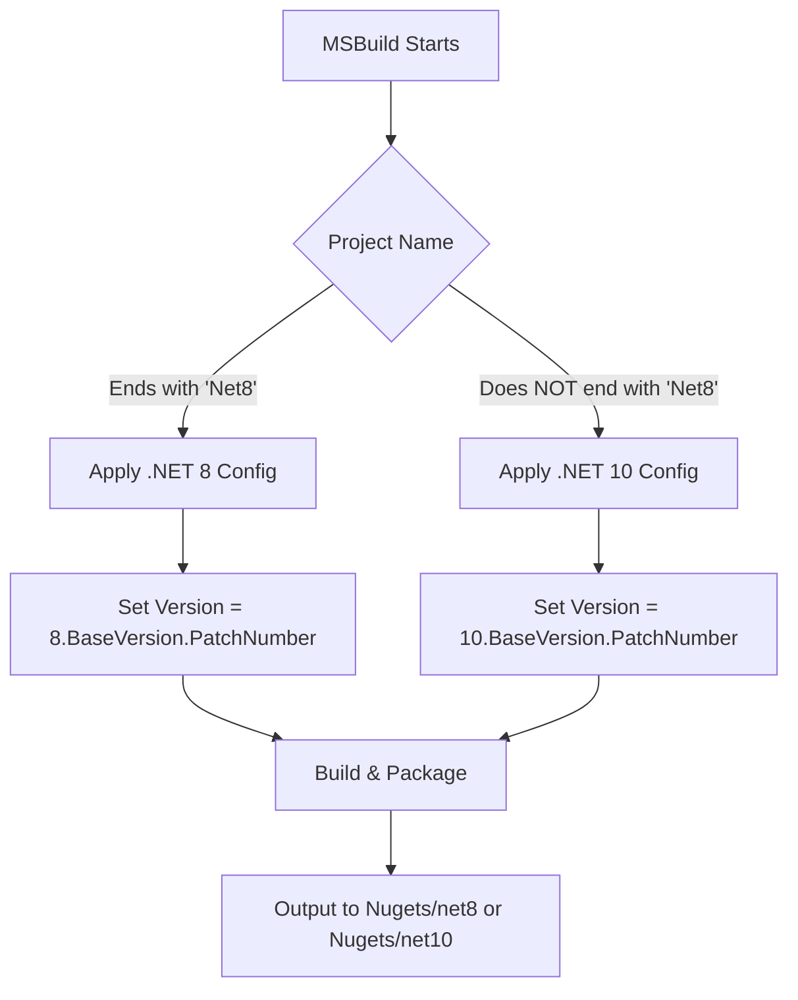

# Build and Versioning System

This document explains the build architecture, versioning strategy, and CI/CD workflow for the ContextBulkExtension multi-target NuGet packages.

---

## Table of Contents

- [Overview](#overview)
- [Project Structure](#project-structure)
- [Versioning Strategy](#versioning-strategy)
- [Build System Architecture](#build-system-architecture)
- [CI/CD Workflow](#cicd-workflow)
- [Local Development](#local-development)
- [Version Detection Logic](#version-detection-logic)
- [Publishing Process](#publishing-process)
- [Troubleshooting](#troubleshooting)

---

## Overview

**Goal:** Build separate NuGet packages for different .NET/EF Core versions from the same source code.

**Strategy:**
- Single source code (`.cs` files)
- Dual `.csproj` files per project (one for .NET 8, one for .NET 10)
- Conditional versioning via `Directory.Build.props`
- Separate GitHub Actions jobs per .NET version

**Packages Produced:**
- `ContextBulkExtension` version **8.x.x** - For .NET 8 / EF Core 8.x
- `ContextBulkExtension` version **10.x.x** - For .NET 10 / EF Core 10.x

---

## Project Structure

```
ContextBulkExtension/
├── Directory.Build.props              # Central versioning and build config
├── ContextBulkExtension.sln           # .NET 10 solution
├── ContextBulkExtension.Net8.sln      # .NET 8 solution
│
├── ContextBulkExtension/              # Main library
│   ├── ContextBulkExtension.csproj          # .NET 10 project
│   ├── ContextBulkExtension.Net8.csproj     # .NET 8 project
│   ├── DbContextBulkExtension.cs            # Shared source files
│   ├── BulkConfig.cs
│   └── [other .cs files]
│
├── ContextBulkExtension.Tests/        # Tests
│   ├── ContextBulkExtension.Tests.csproj     # .NET 10 tests
│   └── ContextBulkExtension.Tests.Net8.csproj # .NET 8 tests
│
├── Nugets/                            # Package output directories
│   ├── net8/                          # .NET 8 packages
│   └── net10/                         # .NET 10 packages
│
└── .github/workflows/
    └── publish-nuget.yml              # CI/CD workflow
```

### Key Files

| File | Purpose |
|------|---------|
| `Directory.Build.props` | Central configuration for versions, package metadata, and conditional logic |
| `*.Net8.csproj` | .NET 8 project files (targets `net8.0`, references EF Core 8.x) |
| `*.csproj` (no suffix) | .NET 10 project files (targets `net10.0`, references EF Core 10.x) |
| `*.Net8.sln` | Solution file for .NET 8 projects |
| `*.sln` (no suffix) | Solution file for .NET 10 projects |

---

## Versioning Strategy

### Version Format

**Pattern:** `<MajorVersion>.<BaseVersion>.<PatchNumber>`

- **MajorVersion**: Matches .NET version (8 or 10)
- **BaseVersion**: Minor + Build version (e.g., 0.20)
- **PatchNumber**: Hotfix/patch version (incremented for each release at same BaseVersion)

### Examples

| .NET Version | BaseVersion | PatchNumber | Final Version |
|--------------|-------------|-------------|---------------|
| 8 | 0.20 | 0 | `8.0.20.0` |
| 8 | 0.20 | 1 | `8.0.20.1` |
| 10 | 0.20 | 0 | `10.0.20.0` |
| 10 | 0.1 | 0 | `10.0.1.0` |

### Version Components

**BaseVersion** (`Directory.Build.props`):
```xml
<BaseVersion>0.20</BaseVersion>
```
- Default version shared by both .NET 8 and .NET 10
- Can be overridden per .NET version (see [Advanced Versioning](#advanced-versioning))

**PatchNumber**:
- Default: `0` (set in `Directory.Build.props`)
- Can be overridden:
  - Via workflow dispatch input
  - Via MSBuild property: `-p:PatchNumber=5`

---

## Build System Architecture

### Directory.Build.props

Central configuration file that MSBuild automatically imports for all projects in the directory tree.

**Key Features:**

1. **Common Properties** (lines 2-20):
   ```xml
   <PropertyGroup>
     <BaseVersion>0.20</BaseVersion>
     <PackageId>ContextBulkExtension</PackageId>
     <Authors>oclockvn</Authors>
     <!-- ... -->
   </PropertyGroup>
   ```

2. **Conditional Logic** (lines 27-49):
   ```xml
   <!-- .NET 8 specific -->
   <PropertyGroup Condition="$(MSBuildProjectName.EndsWith('Net8'))">
     <Version>8.$(BaseVersion).$(PatchNumber)</Version>
     <TargetFramework>net8.0</TargetFramework>
     <PackageOutputPath>$(SolutionDir)Nugets\net8</PackageOutputPath>
   </PropertyGroup>

   <!-- .NET 10 specific (default) -->
   <PropertyGroup Condition="!$(MSBuildProjectName.EndsWith('Net8'))">
     <Version>10.$(BaseVersion).$(PatchNumber)</Version>
     <TargetFramework>net10.0</TargetFramework>
     <PackageOutputPath>$(SolutionDir)Nugets\net10</PackageOutputPath>
   </PropertyGroup>
   ```

3. **Automatic Package Generation**:
   ```xml
   <GeneratePackageOnBuild>True</GeneratePackageOnBuild>
   ```

### How It Works



**Example:**

Building `ContextBulkExtension.Net8.csproj`:
1. MSBuild imports `Directory.Build.props`
2. Evaluates `MSBuildProjectName.EndsWith('Net8')` → `true`
3. Sets `Version = 8.$(BaseVersion).$(PatchNumber)` → `8.0.20.0`
4. Sets `PackageOutputPath = Nugets\net8`
5. Builds and generates `ContextBulkExtension.8.0.20.0.nupkg` in `Nugets\net8\`

---

## CI/CD Workflow

**File:** `.github/workflows/publish-nuget.yml`

### Architecture: Separate Jobs

The workflow uses **independent jobs** (not a matrix) for clean isolation:

```yaml
jobs:
  build-net8:    # Builds .NET 8 package
  build-net10:   # Builds .NET 10 package
```

**Why Separate Jobs?**
- ✅ No workspace conflicts (avoids "ambiguous project name" errors)
- ✅ Clear isolation - each job only sees one .NET version
- ✅ Easier to debug individual builds
- ✅ Can run in parallel
- ✅ Follows EFCore.BulkExtensions pattern

### Workflow Steps (Per Job)


### Triggers

**1. Tag Push:**
```yaml
on:
  push:
    tags:
      - 'v*'
```
Example: Pushing tag `v1.0.0` triggers the workflow

**2. Manual Dispatch:**
```yaml
on:
  workflow_dispatch:
    inputs:
      patch_number:
        description: 'Patch number (default: 0)'
        type: string
        default: '0'
```
Allows manual triggering with custom patch number via GitHub Actions UI.

---

## Version Detection Logic

### MSBuild Property Evaluation (Current Implementation)

**Approach:** Use MSBuild to evaluate the `Version` property as it would during build.

**Code (from workflow):**
```bash
# Use MSBuild to evaluate the Version property
VERSION=$(dotnet msbuild ContextBulkExtension/ContextBulkExtension.Net8.csproj \
  -getProperty:Version \
  -p:PatchNumber=$PATCH_NUMBER \
  -nologo)
```

### Why MSBuild Evaluation?

| Method | Reliability | Supports Different BaseVersion | Auto-syncs with Build |
|--------|-------------|-------------------------------|----------------------|
| **MSBuild Evaluation** ⭐ | ⭐⭐⭐⭐⭐ | ✅ Yes | ✅ Yes |
| Manual XML Parsing | ⭐⭐ | ❌ Limited | ❌ No |

**Advantages:**
1. ✅ **Single source of truth**: Uses same logic as build
2. ✅ **Respects conditionals**: Automatically handles `EndsWith('Net8')` logic
3. ✅ **No manual parsing**: Eliminates fragile grep/sed scripts
4. ✅ **Supports per-framework versions**: Can have different BaseVersion for .NET 8 vs .NET 10
5. ✅ **Type-safe**: MSBuild validates property types

### How It Works

**For .NET 8 Job:**
```bash
# Input: PatchNumber=0
dotnet msbuild ContextBulkExtension/ContextBulkExtension.Net8.csproj \
  -getProperty:Version \
  -p:PatchNumber=0

# MSBuild evaluates:
# - Project name ends with 'Net8' ✓
# - BaseVersion = 0.20 (from Directory.Build.props)
# - Version = 8.$(BaseVersion).$(PatchNumber)
# - Version = 8.0.20.0

# Output: 8.0.20.0
```

**For .NET 10 Job:**
```bash
# Input: PatchNumber=0
dotnet msbuild ContextBulkExtension/ContextBulkExtension.csproj \
  -getProperty:Version \
  -p:PatchNumber=0

# MSBuild evaluates:
# - Project name does NOT end with 'Net8' ✓
# - BaseVersion = 0.20 (from Directory.Build.props)
# - Version = 10.$(BaseVersion).$(PatchNumber)
# - Version = 10.0.20.0

# Output: 10.0.20.0
```

### Testing Version Detection Locally

```bash
# Test .NET 8 version with PatchNumber=0
dotnet msbuild ContextBulkExtension/ContextBulkExtension.Net8.csproj \
  -getProperty:Version \
  -p:PatchNumber=0 \
  -nologo
# Output: 8.0.20.0

# Test .NET 10 version with PatchNumber=5
dotnet msbuild ContextBulkExtension/ContextBulkExtension.csproj \
  -getProperty:Version \
  -p:PatchNumber=5 \
  -nologo
# Output: 10.0.20.5
```

---

## Local Development

### Building Projects

**Build .NET 8 package:**
```bash
dotnet build ContextBulkExtension/ContextBulkExtension.Net8.csproj \
  --configuration Release \
  -p:PatchNumber=0
```
Output: `Nugets/net8/ContextBulkExtension.8.0.20.0.nupkg`

**Build .NET 10 package:**
```bash
dotnet build ContextBulkExtension/ContextBulkExtension.csproj \
  --configuration Release \
  -p:PatchNumber=0
```
Output: `Nugets/net10/ContextBulkExtension.10.0.20.0.nupkg`

### Building via Solution Files

**Build all .NET 8 projects:**
```bash
dotnet build ContextBulkExtension.Net8.sln --configuration Release
```

**Build all .NET 10 projects:**
```bash
dotnet build ContextBulkExtension.sln --configuration Release
```

### Running Tests

**Run .NET 8 tests:**
```bash
dotnet test ContextBulkExtension.Tests/ContextBulkExtension.Tests.Net8.csproj
```

**Run .NET 10 tests:**
```bash
dotnet test ContextBulkExtension.Tests/ContextBulkExtension.Tests.csproj
```

### Testing with `act`

Use [nektos/act](https://github.com/nektos/act) to test the GitHub Actions workflow locally:

```bash
# Test .NET 8 job only
act workflow_dispatch \
  -W .github/workflows/publish-nuget.yml \
  --input patch_number=0 \
  -j build-net8

# Test .NET 10 job only
act workflow_dispatch \
  -W .github/workflows/publish-nuget.yml \
  --input patch_number=0 \
  -j build-net10

# Test both jobs (runs in parallel)
act workflow_dispatch \
  -W .github/workflows/publish-nuget.yml \
  --input patch_number=0
```

---

## Publishing Process

### Manual Publishing (via GitHub Actions UI)

1. Go to **Actions** tab in GitHub
2. Select **Publish NuGet Package** workflow
3. Click **Run workflow**
4. Enter `patch_number` (e.g., `0` for first release, `1` for first hotfix)
5. Click **Run workflow**
6. Monitor both jobs (`build-net8` and `build-net10`)

### Tag-Based Publishing (Recommended)

1. Update `BaseVersion` in `Directory.Build.props` (if needed)
2. Commit changes
3. Create and push a tag:
   ```bash
   git tag -a v1.0.0 -m "Release version 1.0.0"
   git push origin v1.0.0
   ```
4. Workflow triggers automatically
5. Packages published to NuGet.org

### Version Numbering Examples

**Scenario 1: First release at EF Core 8.0.20 / 10.0.20**
- `BaseVersion` = `0.20`
- `PatchNumber` = `0`
- Results: `8.0.20.0` and `10.0.20.0`

**Scenario 2: Hotfix for same EF Core version**
- Keep `BaseVersion` = `0.20`
- Set `PatchNumber` = `1`
- Results: `8.0.20.1` and `10.0.20.1`

**Scenario 3: EF Core 8.0.21 and 10.0.21 released**
- Update `BaseVersion` = `0.21`
- Reset `PatchNumber` = `0`
- Results: `8.0.21.0` and `10.0.21.0`

---

## Advanced Versioning

### Different BaseVersion Per .NET Version

If .NET 8 and .NET 10 packages need different minor versions (e.g., `8.0.20.0` vs `10.0.1.0`):

**Update `Directory.Build.props`:**

```xml
<PropertyGroup>
  <!-- Remove or comment out global BaseVersion -->
  <!-- <BaseVersion>0.20</BaseVersion> -->
</PropertyGroup>

<!-- .NET 8 specific -->
<PropertyGroup Condition="$(MSBuildProjectName.EndsWith('Net8'))">
  <BaseVersion>0.20</BaseVersion>  <!-- Net8-specific -->
  <Version>8.$(BaseVersion).$(PatchNumber)</Version>
  <!-- ... -->
</PropertyGroup>

<!-- .NET 10 specific -->
<PropertyGroup Condition="!$(MSBuildProjectName.EndsWith('Net8'))">
  <BaseVersion>0.1</BaseVersion>   <!-- Net10-specific -->
  <Version>10.$(BaseVersion).$(PatchNumber)</Version>
  <!-- ... -->
</PropertyGroup>
```

**Result:**
- .NET 8: `8.0.20.0`
- .NET 10: `10.0.1.0`

**No workflow changes needed** - MSBuild evaluation automatically picks up the correct version!

---

## Troubleshooting

### Issue: "Ambiguous project name 'ContextBulkExtension'"

**Cause:** Both `.sln` files reference projects with the same name.

**Solution:**
- Workflow builds `.csproj` files directly (not `.sln` files)
- Ensure `ContextBulkExtension.Net8.sln` project names use `.Net8` suffix

**Verify Solution File:**
```bash
grep "Project(" ContextBulkExtension.Net8.sln
```
Should show:
```
Project(...) = "ContextBulkExtension.Net8", "ContextBulkExtension\ContextBulkExtension.Net8.csproj", ...
```

### Issue: Wrong version number detected

**Diagnosis:**
```bash
# Check what MSBuild evaluates
dotnet msbuild ContextBulkExtension/ContextBulkExtension.Net8.csproj \
  -getProperty:Version \
  -p:PatchNumber=0 \
  -nologo
```

**Common Causes:**
- Wrong `BaseVersion` in `Directory.Build.props`
- `PatchNumber` not passed correctly
- Project name doesn't match conditional logic

### Issue: Package not found in artifacts

**Check package output path:**
```bash
# For .NET 8
ls -la ContextBulkExtension/Nugets/net8/

# For .NET 10
ls -la ContextBulkExtension/Nugets/net10/
```

**Verify PackageOutputPath:**
```bash
dotnet msbuild ContextBulkExtension/ContextBulkExtension.Net8.csproj \
  -getProperty:PackageOutputPath \
  -nologo
```

### Issue: Build succeeds but no package generated

**Check if packaging is enabled:**
```bash
dotnet msbuild ContextBulkExtension/ContextBulkExtension.Net8.csproj \
  -getProperty:GeneratePackageOnBuild \
  -nologo
```
Should output: `True`

**Check if project is packable:**
```bash
dotnet msbuild ContextBulkExtension/ContextBulkExtension.Net8.csproj \
  -getProperty:IsPackable \
  -nologo
```
Should output: `true`

### Issue: Package validation fails with "NU3004: The package is not signed"

**Error Message:**
```
error: NU3004: The package is not signed.
Package signature validation failed.
```

**Cause:**
- May occur when using `GeneratePackageOnBuild=True` vs explicit `dotnet pack`
- `dotnet pack` and build-time package generation handle package metadata differently

**Solution:**
- Use explicit `dotnet pack` command instead of relying on `GeneratePackageOnBuild`
- This matches the working workflow approach

**Local testing:**
```bash
# Build first
dotnet build ContextBulkExtension/ContextBulkExtension.Net8.csproj --configuration Release

# Then pack explicitly
dotnet pack ContextBulkExtension/ContextBulkExtension.Net8.csproj \
  --configuration Release \
  --no-build \
  --output ./artifacts

# Validate
dotnet nuget verify ./artifacts/*.nupkg --all
```

---

## Reference

### MSBuild Properties Used

| Property | Set In | Purpose |
|----------|--------|---------|
| `BaseVersion` | `Directory.Build.props` | Minor + Build version (e.g., 0.20) |
| `PatchNumber` | Workflow / `Directory.Build.props` | Hotfix version |
| `Version` | Computed | Full package version |
| `PackageId` | `Directory.Build.props` | NuGet package ID |
| `PackageOutputPath` | `Directory.Build.props` | Where .nupkg files are written |
| `TargetFramework` | `Directory.Build.props` | .NET framework target |
| `GeneratePackageOnBuild` | `Directory.Build.props` | Auto-generate .nupkg on build |

### Workflow Variables

| Variable | Source | Example |
|----------|--------|---------|
| `${{ steps.version.outputs.version }}` | MSBuild evaluation | `8.0.20.0` |
| `${{ steps.version.outputs.PatchNumber }}` | Workflow input | `0` |
| `${{ github.event.inputs.patch_number }}` | Workflow dispatch input | `1` |

### Useful Commands

**Check MSBuild property:**
```bash
dotnet msbuild <project> -getProperty:<PropertyName> -nologo
```

**List all properties:**
```bash
dotnet msbuild <project> -pp:properties.txt
cat properties.txt | grep -i version
```

**Validate package:**
```bash
dotnet nuget verify <package.nupkg> --all
```

---

## See Also

- [Multi-Target NuGet Package Guide](multi-target-nuget-package.md)
- [.NET 12 Package Plan](net12-package-plan.md)
- [Publishing Guide](../PUBLISH.md)
